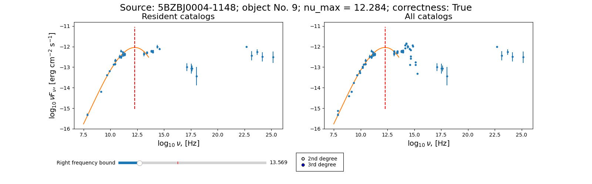

# BZCAT SED Viewer

## Description

The BZCAT SED Viewer script displays the spectral energy distributions (SEDs) for the blazars from the [Roma-BZCAT catalog](https://heasarc.gsfc.nasa.gov/W3Browse/all/romabzcat.html) (5th edition, Massaro et al., 2015, Ap&SS, 357, 75). It also calculates the frequency of the synchrotron component maximum using a third-degree or 2-degree polinomial and allows a user to interactively mark it as 'good' or 'bad'. The results are saved in the original file. One can use the total list of Roma-BZCAT objects (data/BZCAT.csv provided here) or make their own subsample (the file must contain the 'BZCAT5 Source name', 'RA (J2000.0)', and 'Dec (J2000.0)' columns). 

## Data

* [List of blazars](./data/BZCAT.csv) from the [Roma-BZCAT catalog](https://heasarc.gsfc.nasa.gov/W3Browse/all/romabzcat.html)
* Spectral energy distributions for them from [SED Builder](https://tools.ssdc.asi.it/SED/) as of mid-2022. 

## Dependencies

Python3 with the numpy, pandas, matplotlib, and scipy libraries.

Installation of the libraries: pip install -r requirements.txt

## Running the script

python3 sed_viewer.py data/BZCAT.csv 1

Here
* data/BZCAT.csv - the provided file with BZCAT objects and their coordinates (or a file with your subsample)
* 1 - the index number of the object your want to begin with (the first object in the list corresponds to 1, the range is 1-3561)

The script makes two charts - for the data from the SED Builder resident catalogs and for all catalogs. The polynomial fits the resident catalogs only, you can choose the 3rd (best practice) or 2nd degree. The right part of the synchrotron radiation SED is often "contaminated" by the radiation of the host galaxy. For that reason we implemented the slider which allows to tune the higher (right) frequency bound for the polynomial.

Hotkeys in the graphics window:
* Enter or Space - see the next object;
* Backspace - return one step back;
* 'g' - mark as a good fit, the slider for the polynomial right bound will be blocked after setting this mark, and the result wil be fixed; to change the parameters you need to clear the mark first (see below); 
* 'b' - mark as a bad fit (this is a redundant label to a certain degree);
* 'c' - clear a mark;
* 'f' - full screen on/off;
* 'q' - quit

Objects labelled as "good" (correctness == True) will be blocked from further fitting! To continue the fitting, clear the mark first. 

The marking labels are saved in the original file along with the synchrotron peak frequency, right frequency bound, and polynomial order and are available during the following script runnings. One can also change and clean the labels.